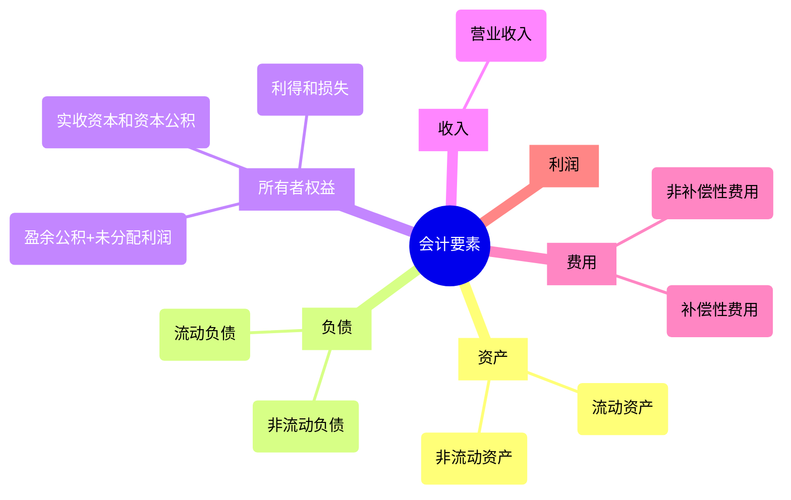

## 1. 会计假设

会计信息形成的三个问题

1. 主体，对谁的经济交易与事项进行记录和报告
2. 时点，在什么时候对经济交易与事项进行记录和报告
3. 金额，以什么金额对经济交易与事项进行记录和报告

解决上述三个问题，需要进行一系列基本假设。会计基本假设是会计确认、计量和报告的前提，是对会计核算所处时间、空间环境等所作的合理设定。会计基本假设包括会计主体、持续经营、会计分期和货币计量

**会计主体假设**：企业应当对其本身发生的交易或者事项进行会计确认、计量和报告。（确定统计范围）


会计主体与法律主体（法人）并非是对等的概念，会计主体超越法律主体。


**持续经营假设**：是指在可以预见的将来，会计主体将会按当前的规模和状态持续经营下去，不会停业，也不会大规模消减业务。(只有持续经营，会计信息才有意义)

**会计分期假设**：是指将一个会计主体持续经营的生产经营活动划分为一个个连续的、长短相同的期间，以便分期结算账目和编制财务会计报告。(为了方便管理)

**货币计量假设**：会计主体在财务会计确认、计量和报告时采用货币作为统一的计量单位，反映会计主体的生产经营活动。(方便比较)

## 2. 会计的要素

会计要素是对会计对象进行的基本分类，是会计核算对象的具体化。资产、负债、所有者权益、收入、费用、利润是我国企业会计的六大会计要素。

1. 资产、负债和所有者权益三项会计要素表现资金运动的相对静止状态，即反映企业的财务状况；
2. 收入、费用和利润三项会计要素表现资金运动的显著变动状态，即反映企业的经营成果


利润是收入与费用配比的结果，比如前面讲到的狭义收入（营业收入）与狭义费用（营业费用）相配比就是营业利润。


按照规定的会计计量属性进行计量，确定其金额。会计计量属性主要包括历史成本、重置成本、可变现净值、现值和公允价值五种。

根据历史成本计量为主会计惯例，除法律、行政法规和国家统一规定的会计制度另有规定者除外。

## 3. 会计科目

会计要素是对会计对象的基本分类，粒度太大，必须对会计要素作进一步分类。**会计科目**是指对会计要素的具体内容进行分类核算的项目，也是经济业务按管理要求归类后的名称。

会计科目按其所归属的会计要素不同，分为

1. 资产类
2. 负债类
3. 所有者权益类
4. 成本类
5. 损益类

会计科目又可以进行进一步细分。会计科目按其所提供信息的详细程度及其统驭关系不同，分为总分类科目和明细分类科目。

1. 总分类科目，又称一级科目或总账科目，它是对会计要素具体内容进行总括分类、提供总括信息的会计科目
2. 明细分类科目，又称明细科目，是对总分类科目作进一步分类、提供更详细和更具体会计信息的科目。对于明细科目较多的总账科目，可在总分类科目与明细科目之间设置二级或多级科目。


会计科目的名称、编号、核算内容、账务处理程序及账户余额等应符合国家的统一规定，不得擅自改变，以保证提供的会计信息口径一致。


会计科目编号就是确定会计科目的号码。对会计科目进行编号是为了便于确定会计科目类别和位置，便于查阅和书写，便于信息化条件下会计管理信息化的需要。我国新会计准则体系下，对会计科目实行的是四位数字编码法。其中，“1”是资产类，“2”是负债类，“3”是共同类，“4”是所有者权益类，“5”是成本类，“6”是损益类。
