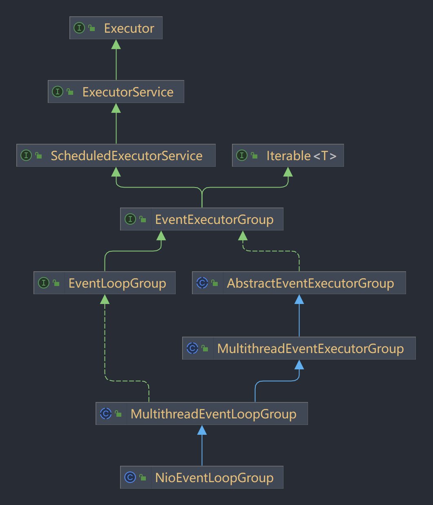

## 1. Pipeline 如何添加 ChannelHandler

Pipeline 其实是一条线，In 和 Out 的 Handler 按顺序添加进入 Pipeline 中。对每个添加的 Handler，通过创建 ChannelHandlerContext 上下文来关联，其结构：


```java
// DefaultChannelPipeline.jva 源代码
@Override
public final ChannelPipeline addFirst(EventExecutorGroup group, String name, ChannelHandler handler) {
    final AbstractChannelHandlerContext newCtx;
    synchronized (this) {
        checkMultiplicity(handler);
        name = filterName(name, handler);

        newCtx = newContext(group, name, handler);

        addFirst0(newCtx);

        // If the registered is false it means that the channel was not registered on an eventLoop yet.
        // In this case we add the context to the pipeline and add a task that will call
        // ChannelHandler.handlerAdded(...) once the channel is registered.
        if (!registered) {
            newCtx.setAddPending();
            callHandlerCallbackLater(newCtx, true);
            return this;
        }

        EventExecutor executor = newCtx.executor();
        if (!executor.inEventLoop()) {
            callHandlerAddedInEventLoop(newCtx, executor);
            return this;
        }
    }
    callHandlerAdded0(newCtx);
    return this;
}
private void addFirst0(AbstractChannelHandlerContext newCtx) {
    AbstractChannelHandlerContext nextCtx = head.next;
    newCtx.prev = head;
    newCtx.next = nextCtx;
    head.next = newCtx;
    nextCtx.prev = newCtx;
}

```

## 2. Netty 的事件在 Pipeline 中的传播

当 Pipeline 处理数据时，他会按照读数据还是写数据，从 Context 链表中按顺序挑选出合适的 Handler 来处理事件和数据，此时 Pipeline 如下图所示


请注意，事件的传播操作，使用 `ctx.fireXXX()` 时，事件将从当前 Context 传播到链中的下一个 InHandler Context，同理 `ctx.write()` 方法，将写入的数据传播到 <span style="color:#dd3918;font-weight:bold;">当前 Context 的前一个 OutHandler Context</span> 中。

但是当使用 Pipeline 的同名方法时，事件会从 Pipeline 的第一个 InHandler 开始处理，write 方法也是将数据从最后一个 OutHandler 开始进行写入处理。

两者完全不同的处理逻辑，请注意！！

## 3. Executor

在创建 BootServer 时，我们可以知道工作组，如下：

```java
EventLoopGroup bossGroup = new NioEventLoopGroup(1);
EventLoopGroup workGroup = new NioEventLoopGroup(4);
ServerBootstrap b = new ServerBootstrap();
b.group(bossGroup, workGroup)
```

Boss EventLoopGroup 用来接收请求，然后将实际 Channel 交由 Work EventLoopGroup 来处理；实际源代码如下：

```java
// ServerBootstrap.java 的 ServerBootstrapAcceptor 私有静态类

@Override
@SuppressWarnings("unchecked")
public void channelRead(ChannelHandlerContext ctx, Object msg) {
    final Channel child = (Channel) msg;

    child.pipeline().addLast(childHandler);

    setChannelOptions(child, childOptions, logger);
    setAttributes(child, childAttrs);

    try {
        // 由 childGroup 处理 channel
        childGroup.register(child).addListener(new ChannelFutureListener() {
            @Override
            public void operationComplete(ChannelFuture future) throws Exception {
                if (!future.isSuccess()) {
                    forceClose(child, future.cause());
                }
            }
        });
    } catch (Throwable t) {
        forceClose(child, t);
    }
}
```

Handler Context 在创建时可以绑定 Executor，如果不指定 Executor，则默认使用 channel 的 Executor，而 Executor 的绑定了线程，在 Context 执行各类方法时，会判断当前线程是否为绑定的线程，如果不是则稍后执行。

```java
// AbstractChannelHandlerContext.java
// 当前 Context 的 executor
@Override
public EventExecutor executor() {
    if (executor == null) {
        return channel().eventLoop();
    } else {
        return executor; // 返回绑定的 executor
    }
}

static void invokeChannelRegistered(final AbstractChannelHandlerContext next) {
    EventExecutor executor = next.executor();
    // executor.inEventLoop() 方法里判断了当前执行线程是否为 executor 的绑定线程
    if (executor.inEventLoop()) { 
        next.invokeChannelRegistered();
    } else {
        executor.execute(new Runnable() {
            @Override
            public void run() {
                next.invokeChannelRegistered();
            }
        });
    }
}
```

也就是说，Piepline 中的添加 Handler 时，如果不指定额外的 ExecutorGroup，整条线的逻辑将会在同一线程中运行。

何时指定额外的 ExecutorGroup 时呢？如果是比较费时的工作，我们可以指定 Netty 系统之外的 ExecutorGroup 来执行该 handler 的工作。

```java
pipeline.addLast(extraGroup, new HelloInHandler())
```

---

附带一张 `NioEventLoopGroup` 的 UML 图




## 4. NIO 的体现

在 `NioEventLoopGroup` 中，会创建 `NioEventLoop` :

```java
// NioEventLoopGroup.java
@Override
protected EventLoop newChild(Executor executor, Object... args) throws Exception {
    SelectorProvider selectorProvider = (SelectorProvider) args[0];
    SelectStrategyFactory selectStrategyFactory = (SelectStrategyFactory) args[1];
    RejectedExecutionHandler rejectedExecutionHandler = (RejectedExecutionHandler) args[2];
    EventLoopTaskQueueFactory taskQueueFactory = null;
    EventLoopTaskQueueFactory tailTaskQueueFactory = null;

    int argsLength = args.length;
    if (argsLength > 3) {
        taskQueueFactory = (EventLoopTaskQueueFactory) args[3];
    }
    if (argsLength > 4) {
        tailTaskQueueFactory = (EventLoopTaskQueueFactory) args[4];
    }
    return new NioEventLoop(this, executor, selectorProvider,
            selectStrategyFactory.newSelectStrategy(),
            rejectedExecutionHandler, taskQueueFactory, tailTaskQueueFactory);
}
```

在 Channel 注册时，实际是注册到 EventLoopGroup 的 child event loop(这里是 NioEventLoop) 中的 selector 中。实际调用的是 channel 的 register 方法，

简要介绍下 IO 事件，即 OPS 参数：

- OP_READ = 1 << 0
- 为什么没有 1 << 1
- OP_WRITE = 1 << 2
- OP_CONNECT = 1 << 3
- OP_ACCEPT = 1 << 4

```java
// AbstractNioChannel.java
@Override
protected void doRegister() throws Exception {
    boolean selected = false;
    for (;;) {
        try {
            selectionKey = javaChannel().register(eventLoop().unwrappedSelector(), 0, this);
            return;
        } catch (CancelledKeyException e) {
            if (!selected) {
                // Force the Selector to select now as the "canceled" SelectionKey may still be
                // cached and not removed because no Select.select(..) operation was called yet.
                eventLoop().selectNow();
                selected = true;
            } else {
                // We forced a select operation on the selector before but the SelectionKey is still cached
                // for whatever reason. JDK bug ?
                throw e;
            }
        }
    }
}
```

上面注册时，关注的事件 OPS 参数为 0，代表先不关注任何事件，只有当出错时，才有通知。这是因为方法在抽象类里面，我们还不知道具体的 Channel 需要监听何种读写事件。

随后在具体的 Channel 实现里面，可依据具体的实现更换事件 OPS 

```java
// AbstractNioChannel.java
@Override
protected void doBeginRead() throws Exception {
    // Channel.read() or ChannelHandlerContext.read() was called
    final SelectionKey selectionKey = this.selectionKey;
    if (!selectionKey.isValid()) {
        return;
    }

    readPending = true;

    final int interestOps = selectionKey.interestOps();
    if ((interestOps & readInterestOp) == 0) {
        // 加入 readInterestOp 是一个构造参数，由继承类传过来
        selectionKey.interestOps(interestOps | readInterestOp);
    }
}

// NioDatagramChannel.java 实现类
public NioDatagramChannel(DatagramChannel socket) {
    super(null, socket, SelectionKey.OP_READ); // 对应上面的 readInterestOp
    config = new NioDatagramChannelConfig(this, socket);
}
// NioServerSocketChannel.java 实现类
public NioServerSocketChannel(ServerSocketChannel channel) {
    super(null, channel, SelectionKey.OP_ACCEPT); // 对应上面的 readInterestOp
    config = new NioServerSocketChannelConfig(this, javaChannel().socket());
}
```

当 Channel 需要写数据时，同样也需要**临时**加入 OP_WRITE 事件， <span style="color:#dd3918;font-weight:bold">读是被动的，一直需要监听，写是主动的，当数据一次性没写完时，需要知道何时能够再次写入，写完时需要取消监听</span>, 详细代码见，重点在最后几行：

```java
//AbstractNioMessageChannel.java
@Override
protected void doWrite(ChannelOutboundBuffer in) throws Exception {
    final SelectionKey key = selectionKey();
    final int interestOps = key.interestOps();

    int maxMessagesPerWrite = maxMessagesPerWrite();
    while (maxMessagesPerWrite > 0) {
        Object msg = in.current();
        if (msg == null) {
            break;
        }
        try {
            boolean done = false;
            for (int i = config().getWriteSpinCount() - 1; i >= 0; i--) {
                if (doWriteMessage(msg, in)) {
                    done = true;
                    break;
                }
            }

            if (done) {
                maxMessagesPerWrite--;
                in.remove();
            } else {
                break;
            }
        } catch (Exception e) {
            if (continueOnWriteError()) {
                maxMessagesPerWrite--;
                in.remove(e);
            } else {
                throw e;
            }
        }
    }
    if (in.isEmpty()) {
        // Wrote all messages.
        if ((interestOps & SelectionKey.OP_WRITE) != 0) {
            key.interestOps(interestOps & ~SelectionKey.OP_WRITE);
        }
    } else {
        // Did not write all messages.
        if ((interestOps & SelectionKey.OP_WRITE) == 0) {
            key.interestOps(interestOps | SelectionKey.OP_WRITE);
        }
    }
}
```

