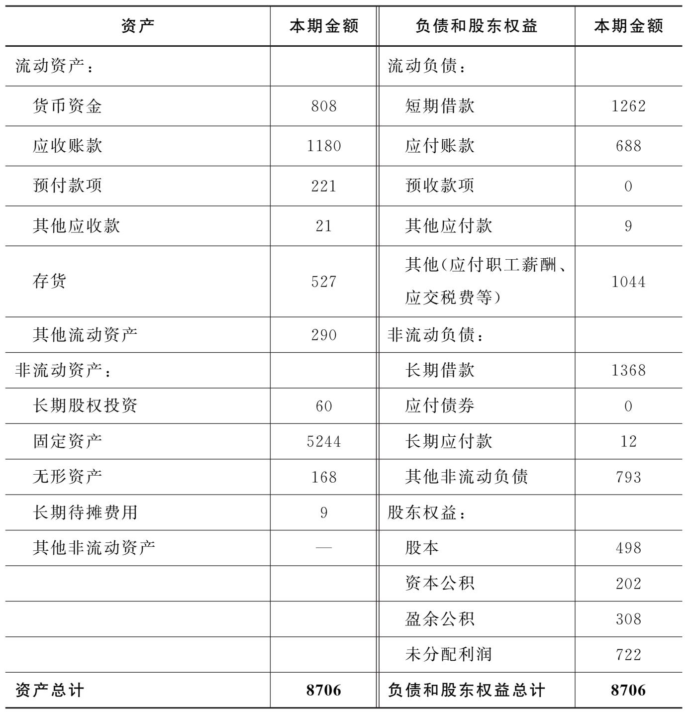

## 0. 三件事

企业一辈子只做三件事：

+ 经营，生产产品、销售产品、回收货款
+ 投资，进入新的业务领域或开发新的产品
+ 融资，在经营或投资过程中，就必须借钱或找别人投资

会计是魔法

## 1. 资产负债表

经营企业有一个最基本的要求，就是保证股东投入的本金不会遭到任何损失。我们必须要知道，本金现在都成了什么，它们现在的价值如何，是不是还保持着原来的价值。因此，我们就需要有一张能描述这些问题的财务报表，这张财务报表就是资产负债表

分为两部分：左边说了一件事——资产，右边说了两件事——负债及股东权益。所以他的本质是会计恒等式

$$
资产 = 负债 + 所有者权益
$$

### 1.1 资产

#### 流动资产

**货币资金**

包括库存现金、银行存款和其他货币资金三个项目的期末余额，具有专门用途的货币资金不包括在内。

**应收账款**

核算企业因销售商品、提供劳务等经营活动应收取的款项

什么会有应收账款？在销售产品的时候，时常有卖掉产品却收不到钱的情况发生，在这种情况下，卖方便获得了收款的权利，这种收款的权利就叫作应收账款。

还有一种特殊的应收款，叫作**其他应收款**。比如不算利息的借款给别人，或员工出差向公司借的备用金，在报销前，在公司账面上就是“其他应收款”

**预付账款**

企业按照合同规定预付的款项。

它带来了一种向卖方收货的权利——预付账款相当于是暂存在卖方处的，只要买方没有获得产品，就都具有这笔预付账款的所有权。因此，预付账款也是一项重要的资产。

**存货**

存货（Inventory）：企业在日常活动中持有以备出售的产成品或商品、处在生产过程中的在产品、在生产过程或提供劳务过程中耗用的材料和物料等。 
生产产品所需的“原材料”、生产出来的“产成品”，以及尚且处在生产过程中的没有完工的“在产品”，都是存货。

在产品（Work in Process）：正在加工，尚未完成的产品。有广、狭二义：广义的在产品包括正在加工的产品和准备进一步加工的半成品，狭义的在产品仅指正在加工的产品。

产成品（Finished Goods）：企业已经完成全部征税过程并已验收入库合乎标准规格和技术条件，可以按照合同规定的条件送交订货单位，或者可以作为商品对外销售的产品。

---

刚才所介绍的货币资金、应收账款、其他应收款、预付账款、存货都是企业的流动资产，各项流动资产在资产负债表中是按照它们各自转换为现金的速度来排序的。

货币资金为什么被排在第一位？因为货币资金本来就是钱，它不用变就已经是钱了。应收账款只要能收回来就能变成钱，所以它排在第二位。存货需要先把它变成应收账款，然后才能变成现金，所以它一定排在应收账款之后。所以说，这些资产都是按照它们变为现金的速度来排列的。

其实，流动资产总能很快地完成“从现金开始又回到现金”的过程。但资产中还有另外一样，即非流动资产，它要完成这个过程则需要一段漫长的时光。
比如说设备，它虽然也能在生产中发挥 自己的价值，但它要经过无数次的生产过程，直至最后将自己消耗殆尽，才能完全变成现金。因此，流动资产与非流动资产的差异就在于是否能在一个循环之内就将自己完全变为现金。

流动资产（Current Assets）：企业可以在一年或者超过一年的一个营业周期内变现或者运用的资产。
非流动资产（Non-current Assets）：流动资产以外的资产。

#### 非流动资产

非流动资产包括长期投资、固定资产、无形资产等。

**长期投资**

长期投资包括什么呢？本来，长期投资可以包括很多情形，比如参股别的公司，小张持有股权；组建一家子公司，小张持有这家子公司的股权；又或者持有债券……只要是长期持有的股权和债权，都算是小张的长期投资。但是在《企业会计准则第22号——金融工具确认和计量》（2018）实施后，债权性质的投资被列入了金融资产，股权投资中投资企业对被投资企业所进行的不具有控制权，也不能施加重大影响的投资也被列入金融资产。所以在现行会计准则下，长期投资只包括对被投资企业拥有控制权、共同控制权或能够施加重大影响的长期股权投资。

长期股权投资（Long-term Investments）：包括能够对被投资单位实施控制，或者与合营单位共同对被投资单位实施控制，或者对被投资单位具有重大影响的权益性投资。

**固定资产**

固定资产（Fixed Assets），指同时具有下列特征的有形资产：（1）为生产商品、提供劳务、出租或经营管理而持有；（2）使用寿命超过一个会计年度。
值得注意的是，在使用的过程中，固定资产会逐渐损耗，其价值也会随着损耗逐渐降低。因此，会计在记账的时候，还需要不断描述这个损耗的量，即折旧。那么又有人要问了，当土地是固定资产时，那土地要怎么折旧呢？
事实上，土地不会随着时间的不断流逝而变得破旧不堪，相反，它可能还会随着时间而不断增值，因此，对于土地而言，是不会有折旧这一说的。
固定资产折旧（Depreciation）：一定时期内为弥补固定资产损耗按照规定的固定资产折旧率提取的固定资产折旧，或按国民经济核算统一规定的折旧率虚拟计算的固定资产折旧。

**无形资产**

无形资产（Intangible Assets and Other Assets）：企业拥有或者控制的没有实物形态的可辨认非货币性资产。本科目核算企业持有的无形资产成本，包括专利权、非专利技术、商标权、著作权、土地使用权等。

#### 计价方式

为了确定资产的价值，我们往往会陷入两难的境地：究竟应该用当时购买资产的成本还是资产现在的市场价格来记录资产的价值呢？它们哪个才能更好地体现出资产的价值呢？

历史成本/原始成本/实际成本（Historical Cost）：资产在其取得时为它所支付的现金或现金等价物的金额；负债在正常经营活动中为交换而收到的或为偿付将要支付的现金或现金等价物的金额。

公允价值/公允市价/公允价格（Fair Value）：熟悉市场情况的买卖双方在公平交易的条件下和自愿的情况下所确定的价格，或无关联的双方在公平交易的条件下一项资产可以被买卖或者一项负债可以被清偿的成交价格。

除了金融资产与房地产之外，大多数资产都是按照历史成本来计价的。

## 2. 利润表

## 3. 现金流表

